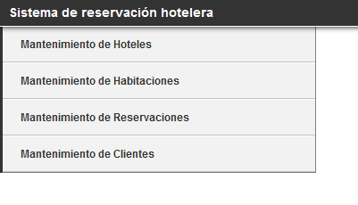
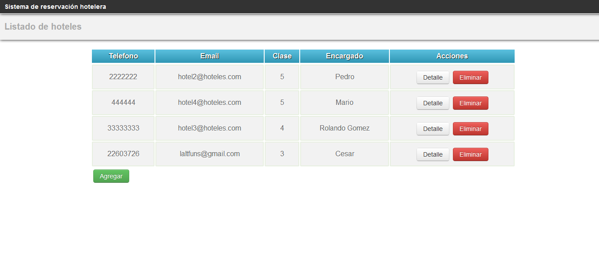
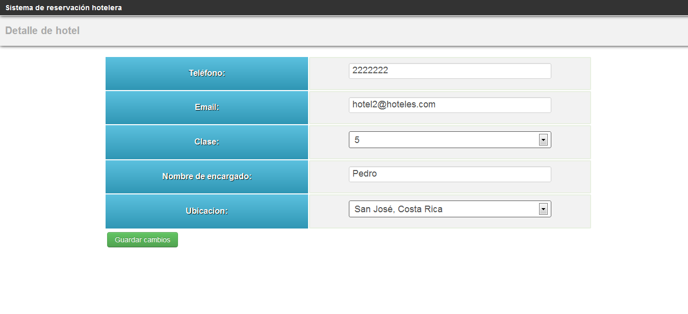
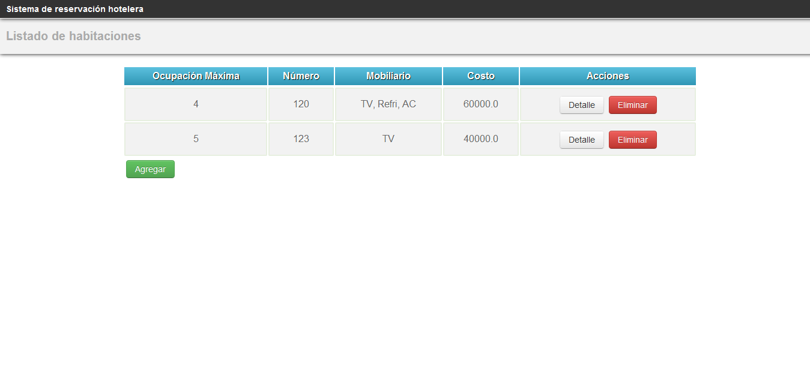
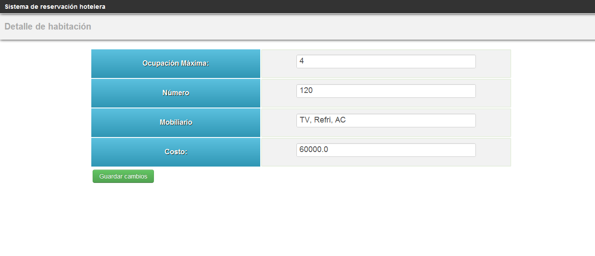
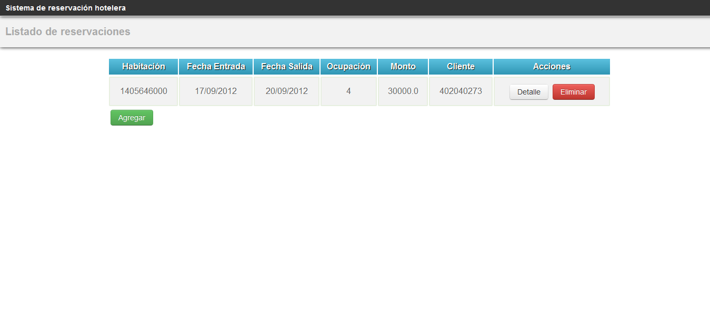
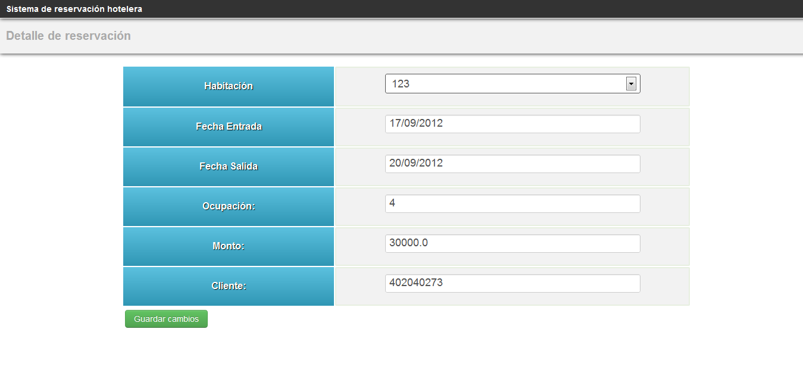
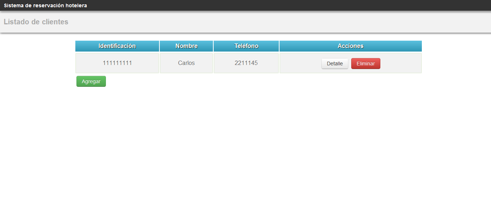
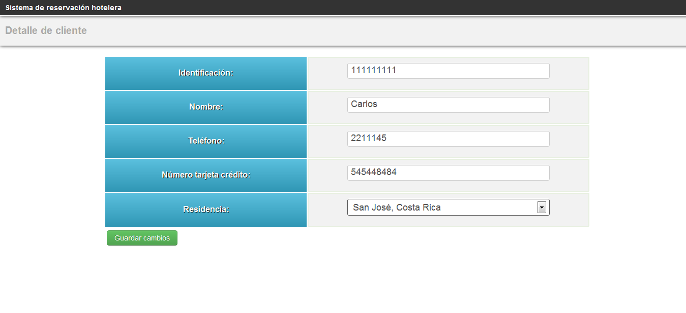

#**Manual de Usuario**#

## Sistema de reservación de hoteles ##

----------

> **Decripción general del sistema**

Un Sistema de reservaciones de hoteles permite que diferentes usuarios realicen sus propias reservas. El sistema mantiene información sobre hoteles, habitaciones, reservaciones, y clientes. De cada hotel se mantiene información sobre su ubicación (país, ciudad), teléfono, correo electrónico, tipo (montaña, playa, ciudad), clase (cantidad de estrellas), y nombre de persona encargada. De cada habitación se guarda su ocupación máxima, su número, mobiliario y el costo por ocupación (simple, doble, triple, cuádruple). Toda esta información referente al hotel es incorporada por la persona encargada de cada hotel.

Cada habitación tiene asociada una lista de reservaciones. Sobre cada reservación se almacena la fecha de entrada, la fecha de salida, la ocupación, el monto a cancelar y la identificación del cliente. Del cliente se almacena el nombre, identificación, teléfono, número de tarjeta de crédito y residencia (país, ciudad). Esta información es incorporada y modificada directamente por el cliente.

En resumen se puede destacar que el sistema permite:

- Este sistema permite el mantenimiento de hoteles, habitaciones, reservaciones y clientes así como las relaciones entre ellos.

- Permite de forma general que los clientes puedan realizar sus reservaciones hoteleras por medio de la selección de habitaciones con diferentes características. 

----------

> **Menú Principal**

EL menú principal, muestra las principales opciones de la aplicación, por lo que el acceso a las mismas se realiza de forma sencilla.

> **Mantenimiento de hoteles**

Listado general de hoteles en donde se puede observar el teléfono, email, clase (cantidad de estrellas) y el nombre del encargado del mismo, además de las acciones correspondientes para ver el detalle y eliminar un hotel.

Detalle correspodiente al hotel, lo cual permite actualizar los datos del hotel:

> **Mantenimiento de habitaciones**

Listado general de habitaciones en donde se puede observar su ocupación, número, mobiliario y el costo de la misma, además de las acciones correspondientes para ver el detalle y eliminar una habitación.

Detalle correspodiente a la habitación, lo cual permite actualizar los datos de la habitación:

> **Mantenimiento de reservaciones**

Listado general de reservaciones en donde se puede observar la habitación seleccionada, fecha de entrada, fecha de salida, la ocupación, el costo y el cliente que realizó la reservación, además de las acciones correspondientes para ver el detalle y eliminar una reservación.

Detalle correspodiente a la reservación, lo cual permite actualizar los datos de la reservación:

> **Mantenimiento de clientes**

Listado general de cliente en donde se puede observar la identificación, nombre, teléfono, además de las acciones correspondientes para ver el detalle y eliminar un cliente.

Detalle correspodiente al cliente, lo cual permite actualizar los datos del cliente:

